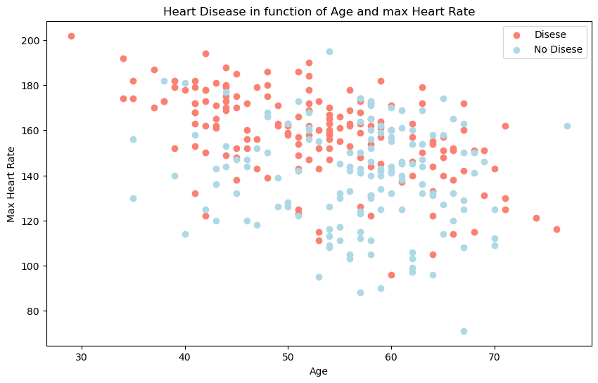
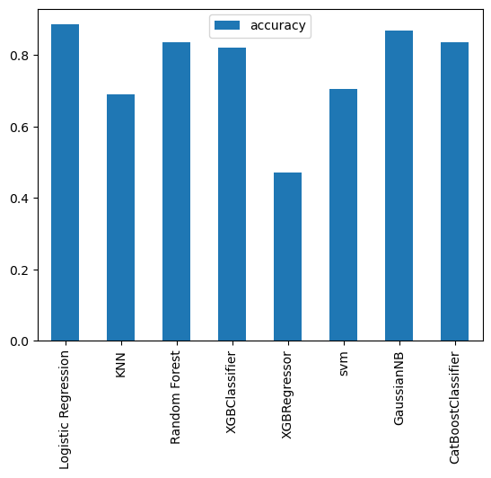

# Heart Disease Prediction Project

The project's emphasis lies in predicting the presence or absence of heart disease through machine learning techniques, utilizing diverse features. The dataset comprises medical attributes potentially relevant to heart disease prediction. The accomplishment of this objective involves the implementation and comparison of multiple classification models.

## Libraries Used

The following Python libraries were used in this project:
- `numpy`: For numerical operations.
- `pandas`: For data manipulation and analysis.
- `matplotlib.pyplot`: For creating visualizations.
- `seaborn`: For enhancing visualization aesthetics.
- `sklearn.linear_model.LogisticRegression`: For implementing Logistic Regression model.
- `sklearn.neighbors.KNeighborsClassifier`: For implementing K-Nearest Neighbors (KNN) classifier.
- `sklearn.ensemble.RandomForestClassifier`: For implementing Random Forest classifier.
- `sklearn.model_selection.train_test_split`: For splitting data into training and testing sets.
- `sklearn.model_selection.cross_val_score`: For cross-validation of models.
- `sklearn.model_selection.RandomizedSearchCV`: For hyperparameter tuning using randomized search.
- `sklearn.model_selection.GridSearchCV`: For hyperparameter tuning using grid search.
- `sklearn.metrics.confusion_matrix`: For calculating confusion matrix.
- `sklearn.metrics.classification_report`: For generating classification report.
- `sklearn.metrics.precision_score`: For calculating precision score.
- `sklearn.metrics.recall_score`: For calculating recall score.
- `sklearn.metrics.f1_score`: For calculating F1 score.
- `sklearn.metrics.plot_roc_curve`: For plotting ROC curves.

## Dataset Columns

The dataset contains the following columns:
1. `age`: Age of the patient (numerical).
2. `sex`: Gender of the patient (0: female, 1: male).
3. `cp`: Chest pain type (numerical).
4. `trestbps`: Resting blood pressure (numerical).
5. `chol`: Serum cholesterol level (numerical).
6. `fbs`: Fasting blood sugar (> 120 mg/dl) (0: false, 1: true).
7. `restecg`: Resting electrocardiographic results (numerical).
8. `thalach`: Maximum heart rate achieved (numerical).
9. `exang`: Exercise induced angina (0: no, 1: yes).
10. `oldpeak`: ST depression induced by exercise relative to rest (numerical).
11. `slope`: Slope of the peak exercise ST segment (numerical).
12. `ca`: Number of major vessels colored by fluoroscopy (numerical).
13. `thal`: Thalassemia type (numerical).
14. `target`: Presence of heart disease (0: no disease, 1: disease).

## Exploratory Data Analysis

Visualizing the data using scatter plots:

## Models Used

The following classification models were implemented and their performance scores were compared:
- **Logistic Regression**: Accuracy - 88.52%
- **K-Nearest Neighbors (KNN)**: Accuracy - 68.85%
- **Random Forest Classifier**: Accuracy - 83.61%
- **XGBoost Classifier**: Accuracy - 81.97%
- **XGBoost Regressor**: Accuracy - 47.18%
- **Support Vector Machine (SVM)**: Accuracy - 70.49%
- **Gaussian Naive Bayes**: Accuracy - 86.89%
- **CatBoost Classifier**: Accuracy - 83.61%
## Models Comparison Graph

## Conclusion

In this project, a variety of machine learning models were employed to predict heart disease using a set of medical attributes. The **Logistic Regression** model demonstrated the highest accuracy among the models tested. Assessment of each model's performance included metrics like precision, recall, F1-score, and ROC curves. This project illustrates the utilization of machine learning methods in healthcare, specifically for the prediction of heart disease.
